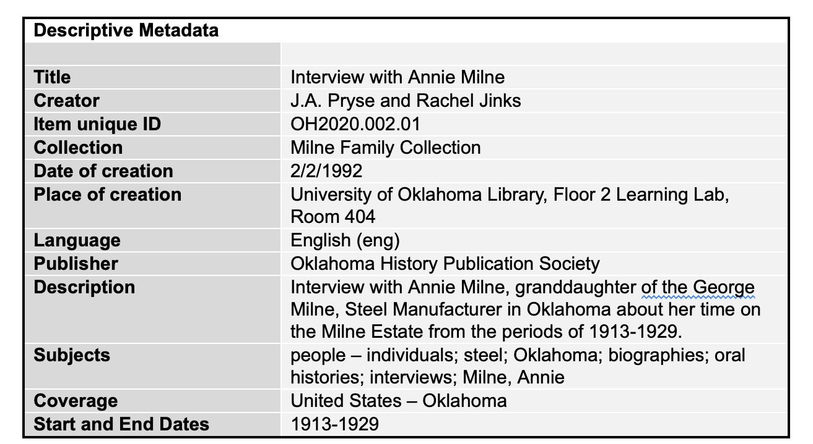
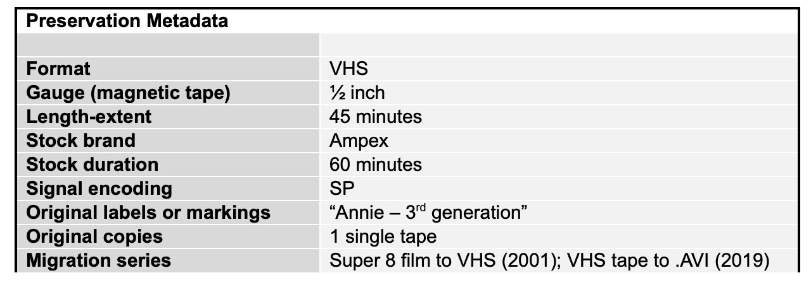
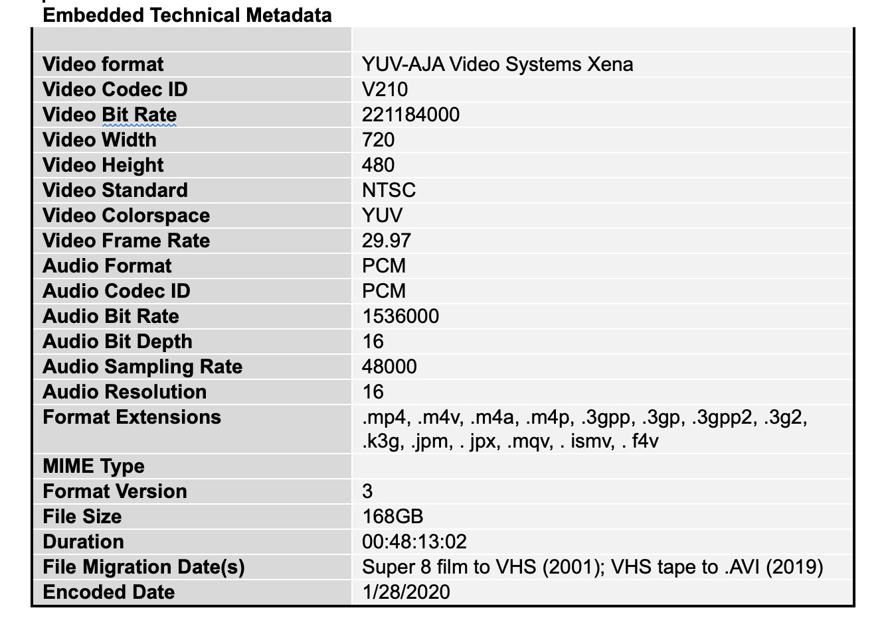
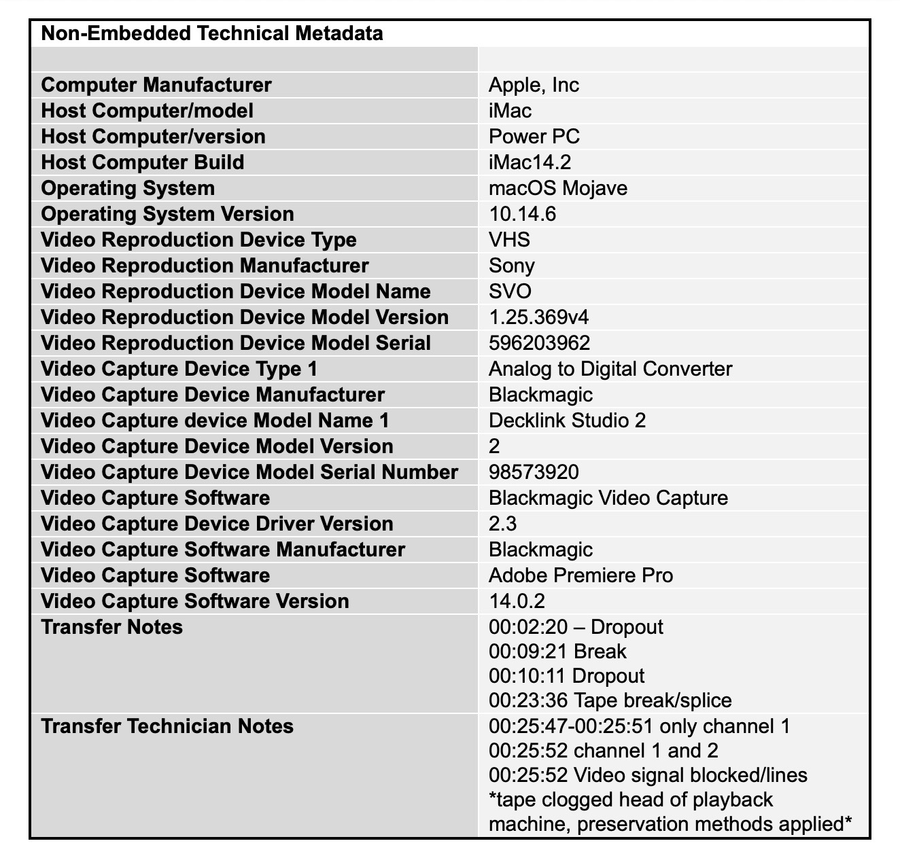

# Oral History Interviews Data Curation Primer

|   Topic   |   Description   |
| :------------- | :------------- |
| File Extension| Varies |
| MIME Type | Varies |
| Structure | Textual transcript accompanied by primary source audio and/or video files |
| Primary fields or areas of use | Multidisciplinary |
| Source and affiliation | Oral History Association (OHA) [https://www.oralhistory.org/about/do-oral-history/](https://www.oralhistory.org/about/do-oral-history/) |
| Metadata standards | TEI [https://tei-c.org/](https://tei-c.org/); PBCore; METS|
| Key questions for curation review | <ul><li>Consider ethical obligations</li><li>Determine if the documentation is sufficient.</li><li>Check for quality assurance and usability issues.</li><li>Indicate what software is required to access and interpret oral history files.</li><li>Inventory recordings, transcriptions, and any annotation or administrative information. </li><li>Perform file preservation actions if needed.|
| Tools for curation review | Varies |
| Date Created/Updated | 2020 |
| Created by| <ul><li>JA Pryse - japryse@ou.edu</li><li>Matthew Harp - matthew.harp@asu.edu</li><li>Sara Mannheimer - sara.mannheimer@montana.edu</li><li>Wanda Marsolek - mars0215@umn.edu</li><li>Wind Cowles - windcowles@princeton.edu</li>   DCN Mentor: Lisa Johnston, University of Minnesota|

**Suggested Citation:** Pryse, J.A.; Harp, Matthew; Mannheimer, Sara; Marsolek, Wanda; and Cowles, Wind. (2020). Oral History Interviews Data Curation Primer. [Data Curation Network GitHub Repository.](https://github.com/DataCurationNetwork/data-primers)

_This work was created as part of the “Specialized Data Curation” Workshop #3 held at Washington University in St. Louis in St. Louis, MO on November 5-6, 2019. These workshops have been generously funded by the Institute of Museum and Library Services # RE-85-18-0040-18._

# Table of Contents

[Description of format](#description-of-format)

[Examples What does a typical oral history dataset look like](#examples-what-does-a-typical-oral-history-dataset-look-like)

[Workflow](#workflow)

>> Ethical issues

>> Documentation

>> Applicable metadata standards, core elements, and readme requirements

>> Technical issues

>> Check Files

[What to look for to make sure this file meets FAIR principles](#what-to-look-for-to-make-sure-this-file-meets-fair-principles)

[Documentation of curation process What do you capture from curation process](#documentation-of-curation-process-what-do-you-capture-from-curation-process)

[Bibliography](#bibliography)

[Appendix 1  Best Practices Pre-production Production Post-production](#appendix-1-best-practices-pre-production-production-post-production)

[Appendix 2 filetype CURATED checklist](#appendix-2-filetype-curated-checklist)

[Appendix 3 Additional Resources](#appendix-3-additional-resources)

>> General References

>> Interacting and Using Oral Histories

>> Unresolved issues/further questions beyond the scope of primer

# Description of format

Oral history interviews are created and used as primary sources for research but are also seen as cultural objects in their own right. “Oral history” is an inclusive term that refers to both the process of conducting spoken interviews with participants (referred to as narrators) and the output products of that process.  Crossing disciplines oral histories may be a part of a historic record; belong to a cultural heritage society, used to confirm authenticity, use cases and testimonials, submitted as legal evidence, included in genealogy research and personal interest.

Oral histories can come in the form of digitized analog audio or videotape recordings. They may be recorded on mobile phone devices, portable audio recorders, video camera recordings, or any other type of device that records and/or transmits audiovisual information. They are a largely qualitative data source that is hard to nail down to one file or document type, yet they are integral to the human experience and can be sources of rich information for text mining, topic modeling, and historical analysis.

The primary output for research purposes is typically considered to be a written transcript of the audio and/or video recording of the interview. Thus, the minimum information needed for a complete oral history dataset is a transcript and a documentation/readme file. Audio and/or video files may also be included; while they have typically been considered as secondary products, this perception is evolving and oral history datasets are increasingly including audio and/or video files. Additional key information for an oral history dataset includes interview documentation and rights statements. Further, it is important to know that the transcript is likely to not be a verbatim copy of the audio; this is within accepted protocols for this type of data. Audio and video may be in compressed or uncompressed formats; technical issues of working with transcriptions, audio, and video files are addressed below (See Appendix 1). 

Like other data formats, oral history datasets can contain information from a wide range of topics. Like other kinds of data that draw information from human sources, there are important ethical issues to be aware of for curation, in addition to technical issues. Oral histories may cover sensitive personal or cultural information, but even if they do not, community ethics guidelines require that the process, from interview to data preservation and use, be guided by respect for both the narrators and their communities. Ethical issues of working with oral history is addressed in more detail below; for further, additional information on ethics in oral history projects, see [OHA Statement on Ethics](https://www.oralhistory.org/oha-statement-on-ethics/). 

Historically, the importance of transcription stemmed from the practice of destroying recordings and leaving only the transcript. Current practices evolved and now some researchers seek the audio or video recording as the first “primary” document, which means curators of oral history research have more variance in data types to process that requires greater context for them to be reused.

# Examples What does a typical oral history dataset look like

A model for better data analysis and curation with respect to oral histories involves a number of structured detailed fields that facilitate reliable research retrievability. The following fields are structured to address current data as well as format migration data to aid in discoverability. 

# Workflow

# Publication in progress. Thanks for your patience!
