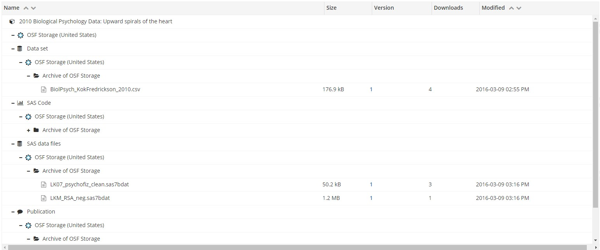
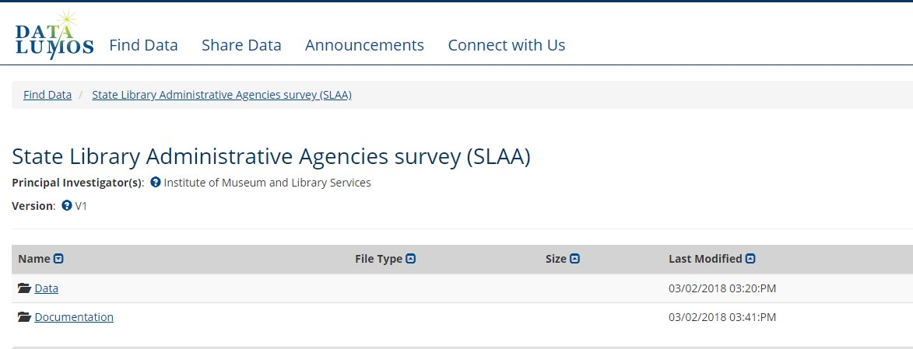
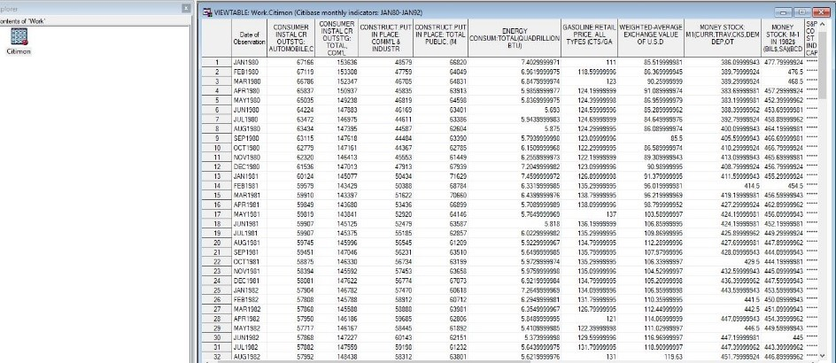
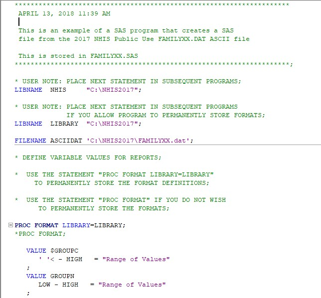
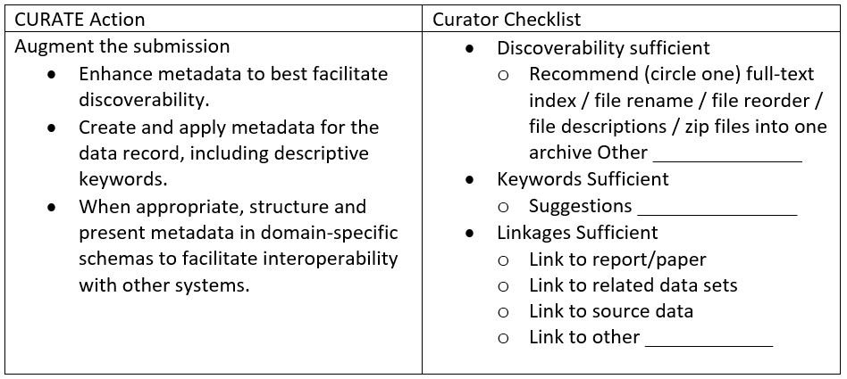
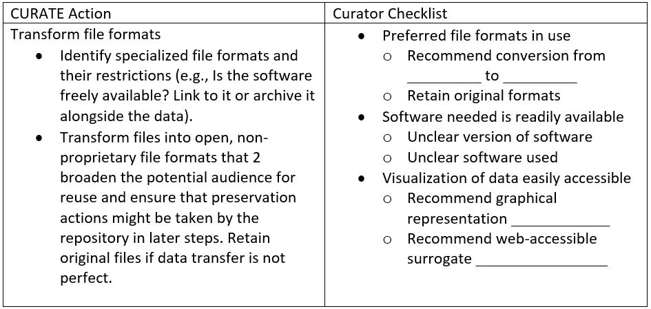
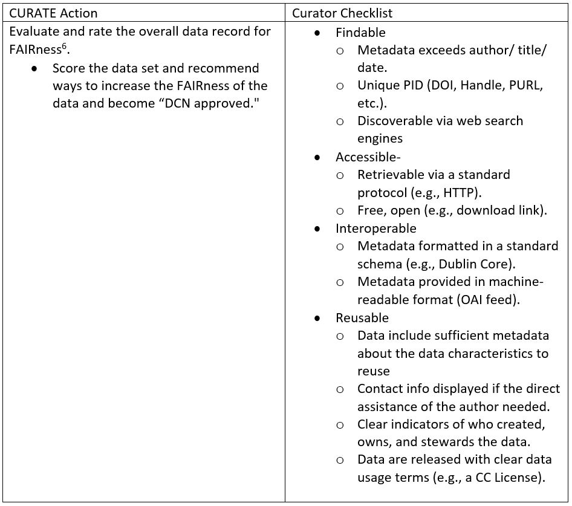

# SAS Data Curation Primer

## Format Overview

|   Topic   |   Description   |
| :------------- | :------------- |
| File Extensions1 | .sas7bdat   .sas7bcat   .sas   .xpt |
| MIME Type | application/x-sas |
| Structure | [The structure of the SAS data set](https://documentation.sas.com/?docsetId=basess&docsetTarget=p1f5xhmkdfhyjcn1n6k9wdcacba0.htm&docsetVersion=9.4&locale=en#:~:text=)(.sas7bdat)  
<ul><li> Data values in a SAS data set are arranged in a matrix/frame structure </li><li> Each data set contains a descriptor portion that includes details about a data set </li></ul>
   
 The structure of SAS programs 2 (.sas)  <ul><li> A SAS statement ends with a semicolon </li><li>	A program starts with a keyword such as proc, and end with another keyword such as run/quit </li></ul>
 |
| Versions | 9.4 ([current](https://www.sas.com/en_us/software/sas9.html)) |
| Primary fields or areas of use | Healthcare, biology, agriculture, business intelligence, finance |
| Source and affiliation | [SAS](https://www.sas.com/en_us/home.html) is developed by SAS Institute  |
| Metadata standards | 
<ul><li> Standards vary by field of research </li><li> The SAS Catalog (.sas7bcat), can store user-defined formats, such as variable level metadata </li>
 |
| Key questions for curation review | 
<ul><li> Where is the data located? What file format/formats was the data set saved? </li><li> What is the data about? </li><li>	Where did the data come from or who collected the data? </li><li> When was the data collected? How was the data collected? </li><li> Is there a readme file, data documentation file or other file which describes how to use the data set? </li><li> Is there a SAS code or program file for data importing, preparation and/or analysis? </li><li> Are there any comments included in the SAS code explaining how to process the code? </li><li> Can SAS data files (.sas .sas7bdat, etc.) be loaded into other software in addition to SAS? </li>
  |
| Tools for curation review | [SAS Universal Viewer](https://support.sas.com/downloads/package.htm?pid=2173)   [SAS University Edition](https://www.sas.com/en_us/software/university-edition.html)   [SAS OnDemand for Academics](https://www.sas.com/en_us/software/on-demand-for-academics.html)   Python, [pandas.read_sas](https://pandas.pydata.org/pandas-docs/stable/user_guide/io.html#sas-formats) or [sas7bdat](https://pypi.org/project/sas7bdat/)   R, [sas7bdat](https://cran.r-project.org/web/packages/sas7bdat/index.html), [rio](https://www.rdocumentation.org/packages/rio/versions/0.5.16) or [haven](https://www.rdocumentation.org/packages/haven/versions/2.3.1) package   [Stat/Transfer](https://stattransfer.com/) |
| Date Created | March 9, 2020 |
| Created by | Creator: Qiong Xu, Queens College of the City University of New York   Mentor: Jenn Darragh, Duke University |
| Date updated and summary of changes made |  |

1 More: [SAS documentation](https://go.documentation.sas.com/?cdcId=pgmsascdc&cdcVersion=9.4_3.4&docsetId=hostwin&docsetTarget=n0sk6o15955yoen19n9ghdziqw1u.htm&locale=en) 

2 SAS Certification Prep Guide: Base Programming for SAS 9, Fourth Edition. Retrieved from https://www.sas.com/storefront/aux/en/certpgbp/71337_excerpt.pdf. 

**Suggested Citation:** Xu, Qiong. (2020). SAS Data Curation Primer. Data Curation Network GitHub Repository. 

This work was created as part of the “Specialized Data Curation” Workshop #3. 

**Contributors:** Gin Corden and Susan Borda.

### Table of Contents

[Format Overview](#format-overview)

[Description of Format](#description-of-format)  

[SAS Application and Research Data Documentation](#sas-application-and-research-data-documentation)

[SAS File Examples](#sas-file-examples) 

[Key Questions to Ask Yourself](#key-questions-to-ask-yourself) 

[Key Clarifications to Get from Researcher](#key-clarifications-to-get-from-the-researcher) 

[Applicable Core Elements of Metadata and Readme Requirements](#applicable-core-elements-of-metadata-and-readme-requirements)

[Resources for Reviewing Data](#resources-for-reviewing-data) 

[Software for Viewing or Analyzing Data](#software-for-viewing-or-analyzing-data) 

[Preservation Actions](#preservation-actions) 

[Documentaition of Curation Process](#documentation-of-curation-process)

[Appendix A Additional Information on Tools](#appendix-a-additional-information-on-tools)

[Appendix B SAS Data File CURATED Checklist](#appendix-b-sas-data-file-curated-checklist)

## Description of Format

.sas is a file extension for SAS programs.

.sas7bdat is a file extension for SAS data sets. SAS data sets (.sas7bdat) store data values and descriptor information. 

- Data values are arranged in a matrix/frame structure 
 
  - The rows are called observations/objects and the columns are called variables/ characteristics
  - Variables contain the data values for each observation.

- Descriptor information includes details about a data set

  - Data set name, data set type, and data set label
  - The names and attributes of all the variables 
  - The number of observations in the data set
  - The date and time that the data set was created and updated.

Note: Extended attributes, which contain metadata for the SAS files, can be defined and preserved with the DATA step. When it is saved on disk, the data set has a new extension “.sas7bxat”.

“.sas7bcat” is a file extension for SAS catalogs. SAS catalogs contain multiple entries such as function key definitions, fonts for graphic applications, some of your selections from the Preferences dialog box, and other information from interactive windowing procedures. 

.xpt is a file extension for transport file. See Library of Congress [information](https://www.loc.gov/preservation/digital/formats/fdd/fdd000464.shtml).

## SAS Application and Research Data Documentation

To learn better how SAS data set is generated, stored, shared and reused, the principal investigator of this primer conducted several semi-structured interviews. The interview questions were adapted from a prior prime3. Three interviewees from two universities in the United States completed their answers via email or face-to-face interview. Two of the three interviewees were faculty and one of them was a doctoral student in statistics. All the interviewees were researchers who used SAS for research and teaching. 

**1. Is SAS used by many researchers doing data analysis? How is SAS compared to similar statistical programs?**

The interviewees indicated that SAS is used by many researchers or scholars who need to deal with large data sets, for example census data, health science data, biology data, agriculture data, etc. Therefore, SAS is most popular among public health scholars, like epidemiologists, biostatisticians, as well as agriculture researchers. Compared to other packages, SAS has the longest history and possibly the largest user group and hence SAS is the most developed package. 
SAS originated from North Carolina State University in the 1960s. Back then, design of experiments and clinical trials both were very hot topics, so departments of agriculture, biology, etc. used SAS very often even now. In addition to research fields, SAS programmers also work at many companies, for example insurance companies, for processing claims, data entry centers, finance industry, etc. 
There are several factors making SAS a popular and powerful data analysis tool. First, SAS has a module for all different types of analysis, graphics, etc. SAS is powerful in building generalized linear (mixed) and linear (mixed) models, design of experiments, repeated measure analysis, sequential analysis and longitudinal data analysis, as well as data management. Even popular software R does not have such powerful tools in these areas. 
Secondly, SAS has large storage to save data that can save computer memory and make data processing smoother. For a large data set, like a 300 GB national data set, only SAS can directly read and analyze it without occupying a huge computer memory. Using other packages, a researcher even may not be able to load the data due to the limit of computer memory. In the meantime, SAS is famous for its information security.
Last but not the least, SAS programming can make researchers analyze data more efficiently. Using SAS programming, researchers don’t need to frequently point and click operational menus. SAS programming gives the researchers the opportunity to know exactly what and how SAS is processing.  

SAS originated from North Carolina State University in the 1960s. Back then, design of experiments and clinical trials both were very hot topics, so departments of agriculture, biology, etc. used SAS very often even now. In addition to research fields, SAS programmers also work at many companies, for example insurance companies, for processing claims, data entry centers, finance industry, etc. 

There are several factors making SAS a popular and powerful data analysis tool. First, SAS has a module for all different types of analysis, graphics, etc. SAS is powerful in building generalized linear (mixed) and linear (mixed) models, design of experiments, repeated measure analysis, sequential analysis and longitudinal data analysis, as well as data management. Even popular software R does not have such powerful tools in these areas. 

Secondly, SAS has large storage to save data that can save computer memory and make data processing smoother. For a large data set, like a 300 GB national data set, only SAS can directly read and analyze it without occupying a huge computer memory. Using other packages, a researcher even may not be able to load the data due to the limit of computer memory. In the meantime, SAS is famous for its information security.

Last but not the least, SAS programming can make researchers analyze data more efficiently. Using SAS programming, researchers don’t need to frequently point and click operational menus. SAS programming gives the researchers the opportunity to know exactly what and how SAS is processing.  

**2. What kind of data do researchers generate on import into SAS?**

Nearly any format of data file can be read into SAS. SAS can import various types of data, Excel files, CSV files, even DBF files. SAS Enterprise Guide can help with importing data and then exporting it as a SAS datafile. 

**3. Considering SAS data sharing and/or reuse via data repositories, how do researchers document their data in SAS, or what related data files need to be documented from SAS?**

SAS can import and export nearly any data format, but other software packages can barely read SAS codes or SAS data files (.sas, .sas7bdat, etc.) directly. To store and share SAS data via a data repository, researchers usually create three files – a metadata file, a code/syntax file, and a data set file. Researchers usually store data into metadata with labels, correct formats, correct variable types, comments, etc. SAS metadata usually contains notes, information for all the variables (i.e., variable names, variable labels, the range of values, data type, etc.) and even some descriptive statistics (i.e., mean, standard deviation, sample size, min, max, missing data, etc.) SAS data set can be opened in the SAS program directly or be read into SAS software by running SAS statements (code/syntax).

**4. What kind of SAS data outputs are researchers able or willing to share? (Considering data sharing and/or reuse via data repositories, what kind of SAS data outputs/files are researchers able or willing to share?)**

Researchers may be willing to share their data openly depending on the data field. Also, data sharing really depends on the original agreement made by researchers and research agencies who funds the data collection. For data sets containing confidential information such as records of clinical trials, researchers can share data in a controlled way if the risk of identity disclosure still exists. In recent years, more and more researches are required by funders and publishers to share data via repositories as a condition for publishing an article. For instance, many researchers who receive research funds from NIH, National Science Foundation, Federal Money, etc. are usually obligated to disseminate the data, which are shared after the data are de-identified to preserve confidentiality protections. 

After researchers collect the data, they are required to remove personally identifiable information or protected health information from the data to minimize the risk of the identification of individual respondents before the data is ready for sharing. In other words, researchers should share data in certain ways if they have an agreement with research funders and publishers. 

<sup3 Deng, Sai; Dull, Joshua; Finn, Jeanine; Khair, Shahira (2019). SPSS Data Curation Primer. Data Curation Network GitHub Repository. https://github.com/DataCurationNetwork/data-primers 

## SAS File Examples

SAS data is comprehensively used in health science, biology, agriculture, business and social sciences. 

In addition to research fields, SAS programmers also work at many companies, for example insurance companies for processing claims, data entry centers, finance industry, etc. 

Examples below link to [OSF](https://osf.io/zma9h/files/), [DataLumos](https://www.datalumos.org/datalumos/project/101764/version/V1/view?path=/datalumos/101764/fcr:versions/V1/Documentation&type=folder) and [CDC](https://www.cdc.gov/nchs/nhis/nhis_2017_data_release.htm) which offer SAS data files for data curation (see Figures 1, 2 and 3).

There might be no a perfect example for SAS data curation due to various limitations, but [the Biological Psychology Data](https://osf.io/zma9h/files/), [the State Library Administrative Agencies survey (SLAA)](https://www.datalumos.org/datalumos/project/101764/version/V1/view?path=/datalumos/101764/fcr:versions/V1/Documentation&type=folder) and [the National Health Interview Survey (NHIS)](https://www.cdc.gov/nchs/nhis/nhis_2017_data_release.htm) created good sample SAS data files for data sharing and reusing. 

There are a variety of files can be documented for data sharing. In general, the essential documentation should include three types of documents: (1) a data set in more than one format; (2) a SAS code/program file for data importing, preparation or analysis; and (3) an instructional file, data documentation file or linkable publication that provides information about variables, data analysis, and/or how to use the data set (see Figures 1, 2 and 3). 

In addition to a SAS data file (.sas7bdat), the data set should be provided with at least one of the following formats to make the data set reusable in other software environments. 

- <em>CVS</em>
- <em>TXT</em>
- <em>ASCII</em>
- <em>MDB/DBF</em>

The SAS code/program file (.sas) is a syntax file which can be used to import data, prepare data (i.e., rename variable names, recode variables, compute variables, etc.), and repeat and validate data analysis. 

A file providing information about how to use the data set can be one of the following documents.

- <em>Readme file (.pdf)</em> directs users how to use the data file. It may contain such contents as data use restriction, data collection instrument (i.e., questionnaire) structure, description of data files and their formats, and how to use the data set in different formats.
- <em>Data documentation file (.pdf)</em> provides such information as research background and purpose, research methodology, data collection and processing, variable description, how to use the data file, etc.
-	<em>A linkable publication (.pdf)</em> is the original publication using the data set, which provides detailed information about the data.

In addition to the above three essential data documents, [the National Health Interview Survey (NHIS)](https://www.cdc.gov/nchs/nhis/nhis_2017_data_release.htm) provides more documents which may be very useful for depositing a large data set. For example,

-	<em>Variable summary (.pdf)</em> is a metadata or variable dictionary file, providing more details about to the variables.
- <em>Variable Layout (.pdf)</em> is a codebook file, providing labels of each numerically categorized variable
- <em>Variable frequencies file (.pdf)</em> provides descriptive statistics of the variables, such as frequency, percent, missing values, etc.

Figure 1: SAS data documentation provided by [Open Science Framework](https://osf.io/zma9h/files/).

Figure 2: SAS data files provided by [DataLumos](https://www.datalumos.org/datalumos/project/101764/version/V1/view?path=/datalumos/101764/fcr:versions/V1/Documentation&type=folder).

Figure 3: SAS data documentation provided by [National Center for Health Statistics and Centers for Disease Control and Prevention](https://www.cdc.gov/nchs/nhis/nhis_2017_data_release.htm).

## Key Questions to Ask Yourself

-	Where is the data located? What file format/formats was the data set saved?
-	What is the data about? 
-	Where did the data come from or who collected the data? 
-	When was the data collected? How was the data collected?
- Is there a readme file, data documentation file or other file which describes how to use the data set?
- Is there a SAS code or program file for data importing, preparation and/or analysis?
- Are there any comments included in the SAS code explaining how to process the code?

## Key Clarifications to Get from Researcher

It is noticed that SAS data can be documented in different formats to facilitate data sharing and reusing.  In addition to SAS data format (.sas7bdat), a SAS data set can be saved as plain text file (i.e., .csv, .txt, .dat, etc.) or database file (.mdb or .dbf).

-	A SAS data file (.sas7bdat) can be opened and viewed directly with SAS installed (see Figure 4 ).
- A text data file (.csv or .txt) and a database file (.mdb or .dbf) can be directly imported into SAS software using SAS import Wizard (see Figure 5). 
- A column-delimited ASCII data file (.dat) can be imported into SAS software running SAS statements (.sas) (see Figure 6).

Figure 4: Directly open a SAS data set (.sas7bdat) and view the data with SAS.

Figure 5: Use SAS Import Wizard to import a data set in CSV format into SAS.

Figure 6: Run SAS statements to extract a data set in an ASCII file (.dat) into SAS. 

Based on the interview results and the above examples, we suggest that at least three data documents should be prepared for SAS data curation - (1) a Readme file or a data documentation, (2) a data set in SAS format (.sas7bdat) and in CSV format (.csv), and (3) a SAS code/program file (.sas) to import, prepare or validate the data set. 

## Applicable Core Elements of Metadata and Readme Requirements

**Core elements of Metadata**

[The fundamental questions about SAS data](https://support.sas.com/resources/papers/proceedings/proceedings/sugi25/25/ad/25p036.pdf) indicated that the core elements of SAS metadata include data location, content and purpose of the data, data ownership and collection procedure, etc.

**Readme requirements**

A “Readme” or a data documentation file includes important [metadata](http://support.sas.com/publishing/pubcat/chaps/59889.pdf) information, such as what the data is about, how the data is used, the meaning and context to the piece of data, etc. Rich and accurate metadata information can facilitate the usage of SAS data sets. As a result, a Readme file or a data documentation file can include the following [elements](https://www.eol.ucar.edu/content/sas-data-set-documentation-readme-guidelines).

**Title:** The title of a readme file should match the name of the data set 

**Author(s):**
-	Name(s) of researcher(s) (e.g., PI and all co-PIs) or organization(s)
-	Contact information (mailing address, telephone/facsimile numbers, and E-mail address of PIs)

**Data file overview and data format:**
- Brief introduction about Readme or data documentation file
- Brief description about the format(s) of data set 
- Brief introduction about SAS code/program file
- Variable definition/description

**Instrument description:**
- Brief description about the research instrument

**Data collection and processing:**
- Description of data collection procedure
- Description of data processing techniques 
- Assessment of the data (e.g., instrument problems, quality issues, etc.)
- Software to view/process the data

**References:**
- List of documents cited in the Readme or the data documentation file. 

**Notes for Data Users**

Since users may need more information about the data set or need to look at other relevant data sets, it is a good practice to provide such information and links to relevant data sets. 

## Resources for Reviewing Data

There are rich instructional and tutorial resources guiding users to review data. The procedure to review a SAS data set may include such steps as (1) creating/processing a SAS data set; (2) checking the structure of the data set; (3) exploring descriptive statistics of the variables, outliers and missing values, etc.

- Step-by-step [instructions](https://www.cdc.gov/nchs/tutorials/NHANES/preparing/download/intro_iii.htm) for reviewing a SAS data set using downloaded SAS files (i.e., SAS codes, data files, etc.)
- [Tips and techniques](https://support.sas.com/resources/papers/proceedings/proceedings/sugi22/BEGTUTOR/PAPER58.PDF) for looking at SAS data files
- Step-by-step instructions for exploring a SAS data set4 
  - [Summarizing Data](https://libguides.library.kent.edu/SAS/ViewContents) with PROC CONTENTS:
  - [Viewing a data set](https://libguides.library.kent.edu/SAS/ViewData) using the Viewtable Window or Printing a data set to the Output Window with PROC PRINT
  - Check [frequencies and missing values](https://libguides.library.kent.edu/SAS/Frequencies) using PROC FREQ
- Reading data into SAS [tutorial](https://www.icpsr.umich.edu/web/pages/ICPSR/help/datausers/) (video)

4 Kent State University Libraries. (2017, May 22). SAS tutorials: Subsetting and splitting data sets. Retrieved from http://libguides.library.kent.edu/SAS/SubsetData. 

 
## Software for Viewing or Analyzing Data

In addition to SAS package (see the “Key clarifications to get from researcher” and “Preservation actions” sections in this primer), a SAS data set (.sas7bdat file) can be imported into the following software with coding or special tools. 

**R:**
- Read SAS data set (.sas7bdat) into RStudio using [sas7bdat](https://www.rdocumentation.org/packages/sas7bdat/versions/0.5), [rio](https://www.rdocumentation.org/packages/rio/versions/0.5.16), or [haven](https://www.rdocumentation.org/packages/haven/versions/2.3.1) package 
- Import SAS Transport files into R using the function read.xport (). 

**Python:**
- Read a SAS XPORT or SAS7BDAT file into Python using the method pandas.read_sas.

See Appendix A “Additional Information on Tools” for more information. 

# Preservation Actions

A SAS data set can be preserved in a data repository with different formats (.sas7bdat, csv, ascii, etc.). Before loading the data set to the repository, it’s recommended to check for correct variables and value labels, and to verify them with Readme through reading/browsing the data set. There are two ways to do so.

- With a SAS software (i.e., SAS 9.4) installed (i.e., in Windows), a SAS data file (.sas7dbat) can be read directly by double clicking the data file, or right clicking the file and selecting “browse with SAS 9.4.”
- Run the code (see Figures 7 and 8) to load data files in different formats into a SAS Work library for checking.

 Figure 7: Load a SAS dataset (.sas7bdat) into SAS.   Data source: http://doi.org/10.3886/E101764V1.

Figure 8: Import a CSV dataset into SAS.   Data source: https://osf.io/zma9h.

Running the IMPORT procedure listed in the first part of the SAS code file (see Figure 8), a curator can check if the code executes. When running the code, be sure to replace the original data directory with the correct directory on the curator’s machine or environment where the data set is saved. 

If other SAS procedures, such as renaming variable names, dropping certain columns, step-by-step data analysis, etc., are included, it’s recommended for the curator to check if the code for each procedure works. But the curator can decide on if this action is necessary depending on patrons’ request. 

For the purposes of facilitating data reuse and data preservation with more longevity, it is recommended that in addition to a SAS7BDAT file, a SAS data set should be saved as plain text formats (i.e., .csv, .dat or .txt) in a data repository. We can save a data set into a text format using the SAS “Export Data” Wizard or running a SAS program (see Figures 9 and 10). 

Figure 9: Save a SAS data file (.sas7bdat) as a CSV file.   Data source: https://osf.io/zma9h. 

 Figure 9: Save a SAS data file (.sas7bdat) as a CSV file.   Data source: https://osf.io/zma9h. 

## Documentation of Curation Process

SAS data sets can be saved in the directories of a local computer or a permanent SAS library. Researchers can save their SAS data sets in different formats. In addition to SAS7BDAT file, researchers can export and save their data in CSV (.csv), ASC II (.dat ), etc.

For SAS data curation, such files need to be captured as (1) a data set in SAS format (.sas7bdat), ASCII text format (.dat ), and/or CSV format (.csv); (2) metadata documentation that includes such information as title, author, variable description, how to use the data set, etc.; (3) a SAS code/program file (.sas) for data importing, preparation or analysis.  

In addition, it is a good practice to document a file of notices to users that provides more information relevant to the data set. For example, where to find more information or data sets relevant to the current data set, etc.

## Appendix A Additional Information on Tools

|   Application/Package   |   SAS Filetypes works with   |  SAS Version  |  Notes  |
| :------------- | :------------- | :------------- | :------------- |
|   [SAS Universal Viewer](https://support.sas.com/downloads/package.htm?pid=2173)   |   Data sets & libraries .xpt	 | Versions 7+   Version 5 |  Free   Windows   application   Allows viewing, sorting, and filtering, and saving as .csv5  |
|   [SAS Universal Edition](https://www.sas.com/en_us/software/university-edition.html)  |     |  |  Free for student/academic use Virtual application, any OS  |
|   [SAS OnDemand for Academics](https://www.sas.com/en_us/software/on-demand-for-academics.html)   |     |  |  Free access to SAS Studio for non-commercial use Browser based |
|   R, [rio](https://www.rdocumentation.org/packages/rio/versions/0.5.16), [sas7bdat](https://www.rdocumentation.org/packages/sas7bdat/versions/0.5), [haven](https://www.rdocumentation.org/packages/haven/versions/2.3.1)   |   .sas7bdat & .sas7bcat   .xpt  |  Versions 7+   Versions 5 & 8  |  See especially convert() function in [rio](https://www.rdocumentation.org/packages/rio/versions/0.5.16), read.sas7bdat () function in [sas7bdat](https://www.rdocumentation.org/packages/sas7bdat/versions/0.5), and read_sas () function in [haven](https://www.rdocumentation.org/packages/haven/versions/2.3.1)|
|   Python, [pandas.read_sas](https://pandas.pydata.org/pandas-docs/stable/user_guide/io.html#sas-formats)   |  .sas7bdat   .xpt  |  Versions 7+   Version ?  |  Notes  |
|   Python, [sas7bdat](https://pypi.org/project/sas7bdat/)   |  .sas7bdat    |  Versions 7+  |  Notes  |
|   Stat/Transfer   Data, transport, cport (read only)   |      |  Versions 6.08+  |  Not free  |
|   [Stat/Transfer](https://stattransfer.com/)   |  Data, transport, cport (read only)    |  Versions 6.08+	  |  Not free |

### Other resources

|   Application/Package   |   SAS Filetypes works with   |  SAS Version  |  Notes  |
| :------------- | :------------- | :------------- | :------------- |
|   SPSS (GET SAS DATA)   |   Data, transport   |  Versions 6+  |  Not free |
|   [Stata](https://www.stata.com/) (import sasxport5/8)   |    .xpt  |  Versions 5 & 8  |  Not free  |

5 Highlight entire table contents by clicking in upper left cell, right-click, and select “Save As…” 

# Appendix B SAS Data File CURATED Checklist

CHECK Step

UNDERSTAND Step

REQUEST Step 

AUGMENT Step

TRANSFORM Step

EVALUATE Step6

DOCUMENT Step

6 Wilkinson, M., Dumontier, M., Aalbersberg, I. et al. The FAIR Guiding Principles for scientific data management and stewardship. Sci Data 3, 160018 (2016). https://doi.org/10.1038/sdata.2016.18 

# Publication in Process - We appreciate your patience

